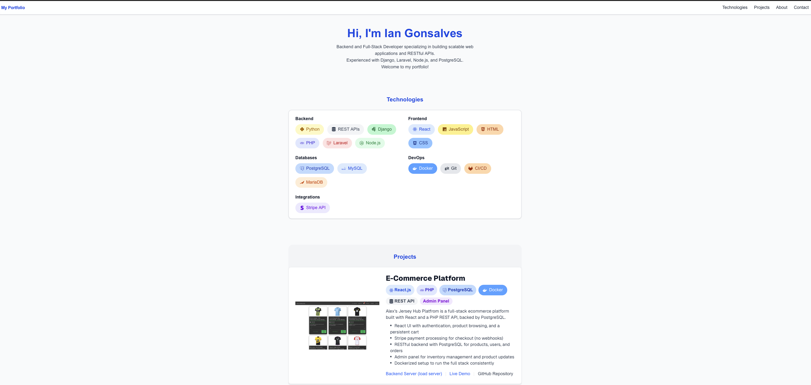

# Personal Portfolio Website

A responsive personal portfolio website showcasing my skills, projects, and professional experience as a Backend/Full Stack Developer.



## Features

- **About Section**: Professional overview highlighting experience at Belsimpel and technical expertise
- **Projects Section**: 
  - Interactive project showcase with descriptions, technologies used, and live demos
  - Consistent technology badges for each project
  - Animated content transitions for a modern feel
- **Contact Section**: Professional contact information and social links
- **Responsive Design**: Mobile-friendly layout using Tailwind CSS

## Technologies Used

- Next.js
- React.js
- TypeScript
- Tailwind CSS
- HTML5 
- JavaScript


## Projects Featured

- **Football Jersey Online Shopping Platform** (PHP + React)
- **Restaurant Booking System** (Django)
- **Calculator** (JavaScript)
- **Etch-a-Sketch** (JavaScript)
- **Rock Paper Scissors Game** (JavaScript)

## Getting Started

First, run the development server:

```bash
npm run dev
```

Open [http://localhost:3000](http://localhost:3000) with your browser to see the result.

You can start editing the page by modifying `app/page.tsx`. The page auto-updates as you edit the file.

## Live Demo

Visit the live portfolio at: [https://iangonsalves.github.io/portfolio/](https://iangonsalves.github.io/portfolio/)

## Contact

- Email: iangonsalves29@gmail.com
- LinkedIn: [Ian Gonsalves](https://www.linkedin.com/in/iangonsalves)
- GitHub: [@iangonsalves](https://github.com/iangonsalves)

## Learn More

To learn more about Next.js, take a look at the following resources:

- [Next.js Documentation](https://nextjs.org/docs) - learn about Next.js features and API.
- [Learn Next.js](https://nextjs.org/learn) - an interactive Next.js tutorial.

## Deploy on Vercel

The easiest way to deploy your Next.js app is to use the [Vercel Platform](https://vercel.com/new?utm_medium=default-template&filter=next.js&utm_source=create-next-app&utm_campaign=create-next-app-readme) from the creators of Next.js.

Check out our [Next.js deployment documentation](https://nextjs.org/docs/app/building-your-application/deploying) for more details.
