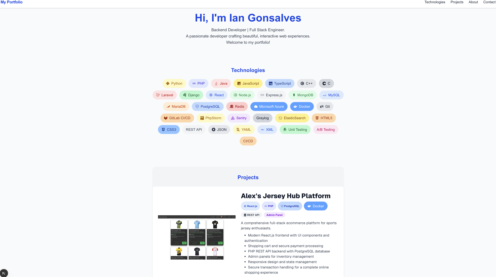

# Personal Portfolio Website

A responsive personal portfolio website showcasing my skills, projects, and professional experience as a Backend/Full Stack Developer.

## Features

- **About Section**: Professional overview highlighting experience at Belsimpel and technical expertise
- **Projects Section**: 
  - Interactive project showcase with descriptions, technologies used, and live demos
  - Consistent technology badges for each project
  - Animated content transitions for a modern feel
- **Contact Section**: Professional contact information and social links
- **Responsive Design**: Mobile-friendly layout using Tailwind CSS

## Technologies Used

- Next.js
- React.js
- TypeScript
- Tailwind CSS
- HTML5 
- JavaScript

## Projects Featured

- **Football Jersey Online Shopping Platform** (PHP + React)
- **Restaurant Booking System** (Django)
- **Calculator** (JavaScript)
- **Etch-a-Sketch** (JavaScript)
- **Rock Paper Scissors Game** (JavaScript)

## Live Demo

Visit the live portfolio at: [https://iangonsalves.github.io/portfolio/](https://iangonsalves.github.io/portfolio/)

## Contact

- Email: iangonsalves29@gmail.com
- LinkedIn: [Ian Gonsalves](https://www.linkedin.com/in/iangonsalves)
- GitHub: [@iangonsalves](https://github.com/iangonsalves)

